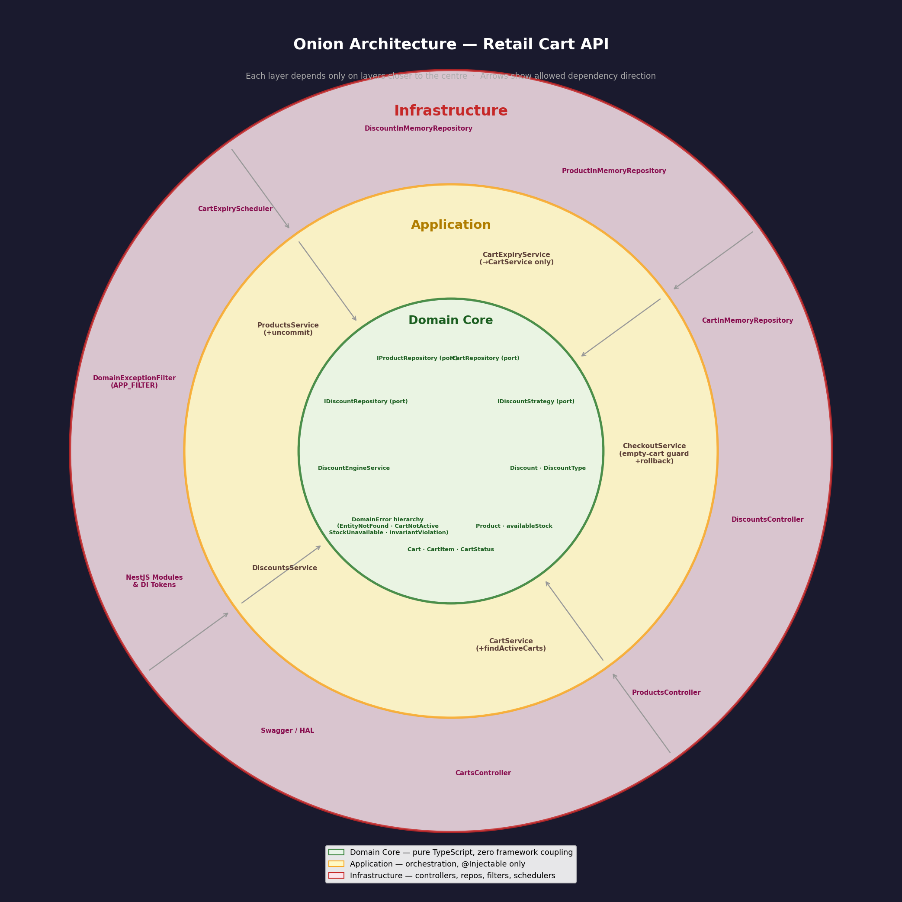
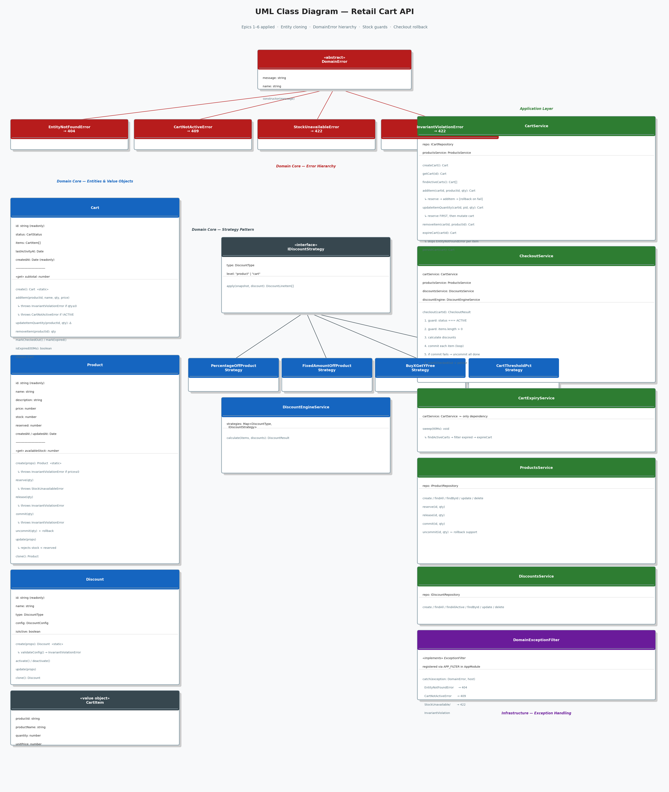
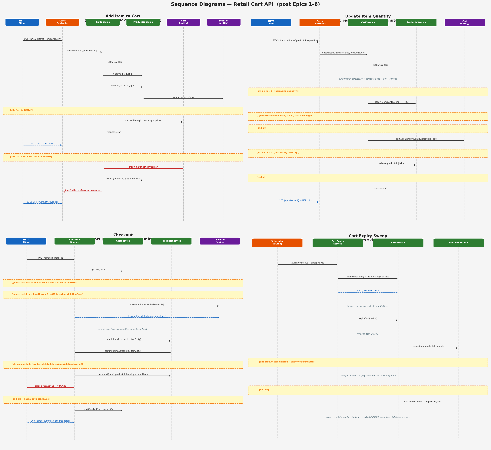

# Retail Shopping Cart API — Solution Notes

---

> # ⚠ REQUIREMENT: Node.js v24.15.0 (LTS)
> **This project requires Node.js >= 24.15.0.**
> Running on an older version is not supported and may produce unexpected behaviour.
> Download the latest LTS from [nodejs.org](https://nodejs.org).

---

## How to run

```bash
npm install
npm start          # starts on http://localhost:3000
npm test           # unit tests   (135 tests)
npm run test:e2e   # E2E tests    (45 tests, supertest — no server needed)
```

Swagger UI is available at **http://localhost:3000/api**.

---

## Diagrams

### Onion Architecture



The system is organised as three concentric rings. Each ring may only depend on rings closer to the centre — never outward.

| Ring | Contents | Framework dependency |
|------|----------|----------------------|
| **Domain Core** (inner) | `Cart`, `Product`, `Discount` aggregates; `IDiscountStrategy`; `DiscountEngineService`; `DomainError` hierarchy (`EntityNotFoundError`, `CartNotActiveError`, `StockUnavailableError`, `InvariantViolationError`) | None — pure TypeScript |
| **Application** (middle) | `CartService`, `CheckoutService`, `CartExpiryService`, `ProductsService`, `DiscountsService` | NestJS `@Injectable` only |
| **Infrastructure** (outer) | HTTP controllers, in-memory repositories, `DomainExceptionFilter`, `CartExpiryScheduler`, NestJS modules | NestJS, Express, `@nestjs/schedule` |

Repository and strategy interfaces (ports) sit on the Domain/Application boundary. Concrete implementations (adapters) live in Infrastructure and are injected at runtime via NestJS DI tokens (`CART_REPOSITORY`, `DISCOUNT_STRATEGIES`, etc.).

---

### UML Class Diagram



Key relationships:

- **Cart** owns a collection of `CartItem` value objects (composition). All mutations go through the `Cart` aggregate — `addItem` enforces quantity > 0 and active-cart status before mutating; `updateItemQuantity` and `removeItem` throw `EntityNotFoundError` if the product is not in the cart. Every `getCart()` / `save()` call returns a deep clone so callers cannot accidentally corrupt stored state.
- **Product** manages its own stock lifecycle (`reserve` / `release` / `commit` / `uncommit`). `availableStock` is a computed getter (`stock − reserved`). `update()` rejects stock values that would drop below the currently reserved quantity.
- **DomainError hierarchy** — four typed subclasses replace the former catch-all, enabling `DomainExceptionFilter` to return the correct HTTP status code without any controller-level try/catch.
- **IDiscountStrategy** is an interface with four concrete implementations. Each strategy declares its `type` and `level` (`product` or `cart`), allowing the engine to route discounts correctly.
- **DiscountEngineService** holds a `Map<DiscountType, IDiscountStrategy>` and runs the two-pass calculation. It depends only on the strategy interface, never on concrete classes.
- **CheckoutService** orchestrates across `CartService`, `ProductsService`, `DiscountsService`, and `DiscountEngineService`. It guards against empty-cart checkout and performs best-effort stock rollback via `uncommit()` if a commit loop fails midway.
- **CartExpiryService** depends only on `CartService` (no direct repository injection). It delegates active-cart discovery to `CartService.findActiveCarts()`.

---

### Sequence Diagrams



**① Add Item to Cart** — `CartService` reserves stock before calling `cart.addItem()`. If the cart is inactive (`CartNotActiveError`), the reservation is immediately released and a 409 is returned. If stock is insufficient, the reservation throws before any cart mutation and a 422 is returned.

**② Update Item Quantity** — `CartService` computes the delta and calls `ProductsService.reserve(delta)` *before* mutating the cart entity. A `StockUnavailableError` is therefore raised before the cart is touched, ensuring the cart and stock always agree.

**③ Checkout** — `CheckoutService` checks that the cart is ACTIVE *and* non-empty before proceeding. Stock is committed item by item. If any `commit()` fails (e.g. a product was deleted), all previously committed items are reversed via `uncommit()` before the error propagates. A 200 with subtotal, discount breakdown, and total is returned on success.

**④ Cart Expiry Sweep** — `CartExpiryScheduler` fires every 30 s. `CartExpiryService.sweep()` calls `CartService.findActiveCarts()` (no direct repo access), filters expired carts, and calls `cartService.expireCart()` on each. Inside `expireCart`, `EntityNotFoundError` from a deleted product is silently skipped so the sweep always completes and the cart is always marked EXPIRED.

---

## Architecture

The solution follows **Onion Architecture** (Ports & Adapters) with three bounded contexts:

| Context | Module | Responsibility |
|---------|--------|----------------|
| products | `ProductsModule` | Catalogue CRUD; stock lifecycle (reserve / release / commit / uncommit) |
| discounts | `DiscountsModule` | Discount catalogue CRUD; strategy registry; discount engine |
| cart | `CartModule` | Shopping cart CRUD; checkout orchestration; expiry sweep |

---

## Design decisions

### Repository isolation via entity cloning

Every in-memory repository clones entities on read and write (`Object.create(Prototype) + Object.assign` to preserve prototype chains). This means the "rollback by not saving" strategy is reliable — if a service operation fails after fetching an entity, the stored state is never corrupted because the fetched object is always an independent copy.

### Typed DomainError hierarchy

`DomainError` is the base class. Four subclasses carry semantic meaning:

| Class | Meaning | HTTP |
|-------|---------|------|
| `EntityNotFoundError` | Aggregate not found by ID | 404 |
| `CartNotActiveError` | Cart is CHECKED_OUT or EXPIRED | 409 |
| `StockUnavailableError` | Insufficient available stock | 422 |
| `InvariantViolationError` | Business rule broken | 422 |

`DomainExceptionFilter` (registered via `APP_FILTER` in `AppModule`) maps each subclass to its HTTP status. Services and entities throw; controllers never catch.

### Stock reservation model

Stock transitions through three states: `available → reserved → committed`.

- `addItem` / `updateItemQuantity` → `product.reserve(delta)`
- `removeItem` / `expireCart` → `product.release(qty)`
- `checkout` → `product.commit(qty)` (decrements both `stock` and `reserved`)
- Checkout rollback → `product.uncommit(qty)` (reinstates `stock` only)

This prevents overselling without requiring pessimistic locking.

### Checkout safety

`CheckoutService.checkout()` applies two guards before touching stock:

1. Cart must be `ACTIVE` → `CartNotActiveError` (409)
2. Cart must have at least one item → `InvariantViolationError` (422)

On partial commit failure, already-committed items are reversed via `uncommit()` (best-effort — individual rollback failures are silently ignored).

### Cart expiry resilience

`CartExpiryService.expireCart()` wraps each `product.release()` in a try/catch. `EntityNotFoundError` (product deleted since item was added) is silently skipped. Any other error still propagates. This ensures the expiry sweep always terminates and every eligible cart is marked `EXPIRED`.

### Discount engine (two-pass)

1. **Pass 1 — product-level strategies**: run all matching active discounts; amounts stack.
2. **Pass 2 — cart-level strategies**: run on the post-pass-1 subtotal; only the *best* (highest saving) cart discount applies.

Four strategies: `PERCENTAGE_OFF_PRODUCT`, `FIXED_AMOUNT_OFF_PRODUCT`, `BUY_X_GET_Y_FREE`, `CART_THRESHOLD_PERCENTAGE`.

### HATEOAS

Every resource response is wrapped in `{ data: T, _links: Record<string, HalLink> }`. Cart links are state-driven:

- `ACTIVE`: exposes `addItem` and `checkout` links.
- `CHECKED_OUT` / `EXPIRED`: exposes only `self`.

### Testing strategy

Tests verify **observable behaviour** (state, return values, thrown exceptions) — never mock call sequences. Application-service tests use real in-memory repositories so they exercise the full use-case without coupling to implementation details. E2E tests wire the `DomainExceptionFilter` via `app.useGlobalFilters()` and assert the precise HTTP status *and* `error` name in the response body.

---

## Assumptions

- **Persistence**: in-memory only (data is lost on restart). Production would swap `*InMemoryRepository` for database-backed implementations without touching domain or application code.
- **Authentication / multi-tenancy**: out of scope; all carts and products are globally shared.
- **Currency**: all prices are stored and returned as JavaScript `number` (float). `toFixed(2)` is applied at subtotal/total boundaries. A production system would use integer cents or a `Decimal` library.
- **Discount `config` validation**: the DTO accepts a plain object (`@IsObject()`). Deep structural validation per discount type is enforced in `Discount.create()` at the domain layer via `InvariantViolationError`.
